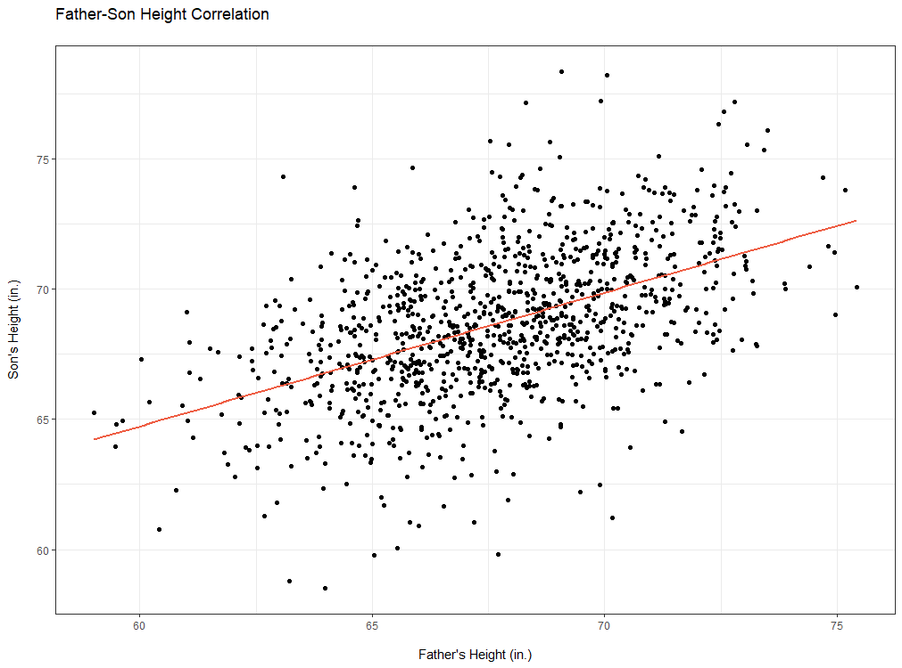

```{r setup, include=FALSE}
knitr::opts_chunk$set(echo = TRUE)
```

\newpage

# Data Preparation

## Normalization

Features sometimes need to be scaled so they fit into a standard range. This involves transforming variables into a narrower or wider range than they are found in the observed data.

Two common methods for scaling features are **min-max normalization** and **z-score normalization**, each shown below:

\[
X_{new} = \frac{X-min(X)}{max(X)-min(X)}
\]

\[
X_{new} = \frac{X-\mu}{\sigma} = \frac{X-mean(X)}{StdDev(X)}
\]

# Algorithms

## Regression Algorithms

### Simple Linear Regression

```{r echo=FALSE, out.width="100%", fig.cap=NULL, fig.align="center"}

```

**Simple linear regression** is a statistical method for evaluating the relationship between two continuous variables. One variable, denoted $x$, is the **independent variable** (also called **predictor variable**) that is used to predict the **dependent variable** (also called **response variable**), denoted $y$.

In linear regression, we use methods such as **ordinary least squares** to approximate the equation of a line describing the relationship between the predictor and response variables. We find a **correlation coefficient**:

\[
r = \frac{1}{n - 1} \sum \left(\frac{x-\bar{x}}{s_x}\right) \left(\frac{y-\bar{y}}{s_y}\right)
\]

In simple linear regression, we estimate two coefficients, $\beta_0$ (the y-intercept) and $\beta_1$ (the regression slope). Because this is an estimate, there is a residual error, $\epsilon$. These are combined to form a **line of best fit**:

\[
\hat{y} = \beta_0 + \beta_1 x + \epsilon
\]

Functions related to running simple linear regression models in R are:

| Function | Package | Description | Example |
|----------|---------|-------------|---------|
| `cor()` | stats | Calculate correlation coefficient. | `cor(x, y)` |
| `lm()` | stats | Train a linear regression model. | `lm(sheight ~ fheight, data = father.son)` |
| `predict()` | stats | Predict values using the trained model. | `m <- lm(y ~ x)`\break`predict(m, test.data)` |
| `summary()` | base | Summarize a linear model. | `m <- lm(y ~ x)`\break`summary(m)` |
| `confint()` | stats | Compute confidence interval for model parameters. | `m <- lm(y ~ x)`\break`confint(m)` |

## Classification Algorithms

### Naive Bayes

The **Naive Bayes classifier** is a probabilistic machine learning algorithm that predicts class labels for a factor by using a probability found from the training data. The classifier assumes that all features contribute equally and are independent of each other. This classifier relies on **conditional probability**, or the probability of an event $A$ occurring, given that an event $B$ has occurred:

\[
P(A|B) = \frac{P(A \cap B)}{P(B)} = \frac{P(B|A)P(B)}{P(A)}
\]

In the Naive Bayes setting, the probability of level $L$ for class $C$ (denoted $C_L$), given feature $F$, is:

\[
P(C_L|F) = \frac{P(F|C_L)P(F)}{P(C_L)}
\]

This is generalizable to:

\[
P(C_L|F_1,F_2,...,F_n) = \frac{P(F_1,F_2,...,F_n|C_L)P(F_1,F_2,...,F_n)}{P(C_L)} = P(C_L) \prod_{i=1}^{n}P(F_i|C_L)
\]

Functions related to running Naive Bayes classification in R are:

| Function | Package | Description | Example |
|----------|---------|-------------|---------|
| `naiveBayes()` | e1071 | Train a Naive Bayes classifier. | `naiveBayes(y ~ ., data, laplace = 1)` |
| `predict()` | stats | Predict values using the trained model. | `m <- naiveBayes(y ~ ., data)`\break`predict(m, test.data)` |
| `confusionMatrix()` | caret | Calculate a confusion matrix. | `confusionMatrix(predicted, ground.truth)` |
