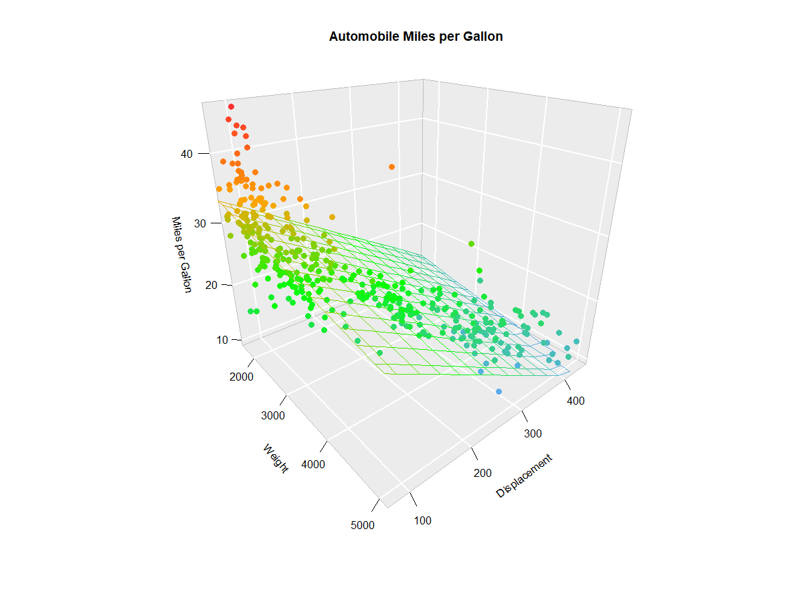
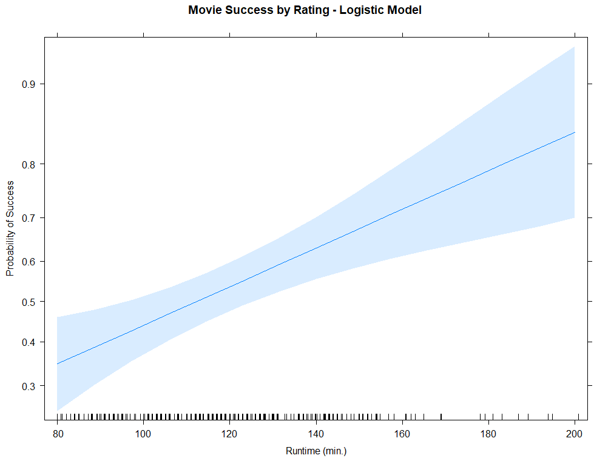

```{r setup, include=FALSE}
knitr::opts_chunk$set(echo = TRUE)
```

\newpage

# Data Preparation

## Normalization

Features sometimes need to be scaled so they fit into a standard range. This involves transforming variables into a narrower or wider range than they are found in the observed data.

One method for scaling features is **min-max normalization**, which uses the minimum and maximum values within the feature to produce a value between 0 and 1:

\[
X_{new} = \frac{X-min(X)}{max(X)-min(X)}
\]


```{r echo=TRUE}
x <- seq(10, 30, by = 1)
x.new <- (x - min(x)) / (max(x) - min(x))
```

This method is useful when the values different features are required to be within the same range, for example with K-Nearest Neighbors classifiers and K-Means clustering.

Another method for scaling features is **z-score normalization**, which standardizes the feature to have the features of the normal distribution (with a mean of 0 and standard deviation of 1):

\[
X_{new} = \frac{X-\mu}{\sigma} = \frac{X-mean(X)}{StdDev(X)}
\]

```{r echo=TRUE}
x <- seq(5, 45, by = 1)
x.new <- (x - mean(x)) / sd(x)
```

\newpage

# Algorithms

## Regression Algorithms

### Simple Linear Regression

```{r echo=FALSE, out.width="100%", fig.cap=NULL, fig.align="center"}
knitr::include_graphics("images/SimpleLinearRegression.png")
```

**Simple linear regression** is a statistical method for evaluating the relationship between two continuous variables. One variable, denoted $x$, is the **independent variable** (also called **predictor variable**) that is used to predict the **dependent variable** (also called **response variable**), denoted $y$.

In linear regression, we use methods such as **ordinary least squares** to approximate the equation of a line describing the relationship between the predictor and response variables. We find a **correlation coefficient**:

\[
r = \frac{1}{n - 1} \sum \left(\frac{x-\bar{x}}{s_x}\right) \left(\frac{y-\bar{y}}{s_y}\right)
\]

In simple linear regression, we estimate two coefficients, $\beta_0$ (the y-intercept) and $\beta_1$ (the regression slope). Because this is an estimate, there is a residual error, $\epsilon$. These are combined to form a **line of best fit**:

\[
\hat{y_i} = \beta_0 + \beta_1 x_i + \epsilon
\]

Functions related to running simple linear regression models in R are:

| Function | Package | Description | Example |
|----------|---------|-------------|---------|
| `cor()` | stats | Calculate correlation coefficient. | `cor(x, y)` |
| `lm()` | stats | Train a linear regression model. | `lm(sheight ~ fheight, data = father.son)` |
| `predict()` | stats | Predict values using the trained model. | `m <- lm(y ~ x)`\break`predict(m, test.data)` |
| `summary()` | base | Summarize a linear model. | `m <- lm(y ~ x)`\break`summary(m)` |
| `confint()` | stats | Compute confidence interval for model parameters. | `m <- lm(y ~ x)`\break`confint(m)` |

### Multiple Linear Regression

```{r echo=FALSE, out.width="100%", fig.cap=NULL, fig.align="center"}

```

**Multiple linear regression** is a statistical method for evaluating the relationship between a response (dependent) variable and two or more predictor (independent) variables. It generalizes simple linear regression by allowing for the use of multiple predictor variables instead of just one.

In multiple linear regression, we estimate a $\beta_0$ coefficient (the y-intercept), as well as a $\beta_i$ coefficient for each of $n$ predictor variables. This produces a **line of best fit**:

\[
\hat{y} = \beta_0 + \beta_1 x_{1} + \beta_2 x_{2} + ... + \beta_n x_{n} + \epsilon
\]

\[
= \beta_0 + \sum_{i=1}^{n}{\beta_i x_i} + \epsilon
\]

Functions related to running multiple linear regression models in R are:

| Function | Package | Description | Example |
|----------|---------|-------------|---------|
| `cor()` | stats | Calculate correlation coefficient. | `cor(x, y)` |
| `lm()` | stats | Train a linear regression model. | `lm(z ~ x + y, data = my.data)` |
| `predict()` | stats | Predict values using the trained model. | `m <- lm(z ~ x + y)`\break`predict(m, test.data)` |
| `summary()` | base | Summarize a linear model. | `m <- lm(y ~ x)`\break`summary(m)` |
| `confint()` | stats | Compute confidence interval for model parameters. | `m <- lm(z ~ x + y)`\break`confint(m)` |

### Logistic Regression

```{r echo=FALSE, out.width="100%", fig.cap=NULL, fig.align="center"}

```

**Logistic regression** is a statistical method for predicting the outcome of a binary dependent variable. It can be used to describe the relationship between a binary response variable and one or more predictor variables.

Logistic regression predicts the probability, $\hat{p}$ of a binary event occurring using the **log odds** of the event (e.g., *has a disease*, *purchases a product*). This is done using the **logit function**, which maps the values of the dependent variables onto a range between negative infinity and positive infinity:

\[
logit(p) = ln \left(\frac{p}{1-p}\right)
\]

where $p=p(success)$ is the probability of a binary event occurring and $1-p=p(failure)$ is the probability of a binary event *not* not occurring.

This function gives values between 0 and 1 on the x axis. We take the inverse logit function to map onto values between 0 and 1 on the y axis. For some number $\alpha$, the **inverse logit function** is given by:

\[
logit^{-1}(\alpha) = \frac{1}{1-e^{-\alpha}} = \frac{e^\alpha}{1-e^\alpha}
\]

In the regression setting, $\alpha$ is a linear equation $\beta_0 + \beta_1x$, so the inverse logit function can be expanded to:

\[
logit^{-1}(\beta_0 + \beta_1x) = \frac{1}{1-e^{-(\beta_0 + \beta_1x)}} = \frac{e^{\beta_0 + \beta_1x}}{1-e^{\beta_0 + \beta_1x}}
\]

## Classification Algorithms

### Naive Bayes

The **Naive Bayes classifier** is a probabilistic machine learning algorithm that predicts class labels for a factor by using a probability found from the training data. The classifier assumes that all features contribute equally and are independent of each other. This classifier relies on **conditional probability**, or the probability of an event $A$ occurring, given that an event $B$ has occurred:

\[
P(A|B) = \frac{P(A \cap B)}{P(B)} = \frac{P(B|A)P(B)}{P(A)}
\]

In the Naive Bayes setting, the probability of level $L$ for class $C$ (denoted $C_L$), given feature $F$, is:

\[
P(C_L|F) = \frac{P(F|C_L)P(F)}{P(C_L)}
\]

This is generalizable to:

\[
P(C_L|F_1,F_2,...,F_n) = \frac{P(F_1,F_2,...,F_n|C_L)P(F_1,F_2,...,F_n)}{P(C_L)} = P(C_L) \prod_{i=1}^{n}P(F_i|C_L)
\]

Functions related to running Naive Bayes classification in R are:

| Function | Package | Description | Example |
|----------|---------|-------------|---------|
| `naiveBayes()` | e1071 | Train a Naive Bayes classifier. | `naiveBayes(y ~ ., data, laplace = 1)` |
| `predict()` | stats | Predict values using the trained model. | `m <- naiveBayes(y ~ ., data)`\break`predict(m, test.data)` |
| `confusionMatrix()` | caret | Calculate a confusion matrix. | `confusionMatrix(predicted, ground.truth)` |
